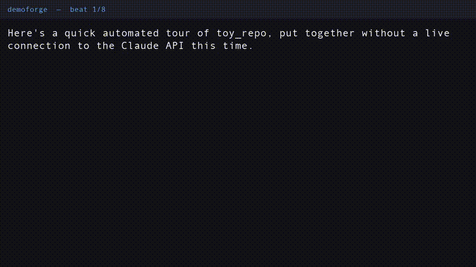
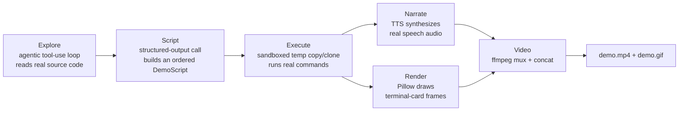

# demoforge

Point demoforge at a code repository. Get back a real, narrated video demo
of it — no script to write, no screen to record, no voiceover to read
aloud yourself.

demoforge is an AI agent that actually **reads the code** of a target
repository (not just its README), decides what's genuinely worth
demonstrating, runs real commands against a disposable sandbox copy of the
repo, narrates the result with real synthesized speech, and renders it all
into a playable `demo.mp4` (plus a `demo.gif` you can drop straight into a
GitHub README).

Below is the real `demo.gif` this repository's own pipeline produced for
the bundled `examples/toy_repo` project — generated end-to-end by the code
in this repo, with real audio, real command output, and no hand-editing:



The GIF above is a silent, README-embeddable preview. The full version with
real narrated audio is checked into this repo at
[`docs/demo.mp4`](docs/demo.mp4) (24.35s, H.264 video + AAC audio,
generated by the exact command in the Quickstart below) — GitHub doesn't
autoplay video inline in a README, so download or open that file directly
to hear it.

## How it works



1. **Explore** — a manual agentic tool-use loop gives Claude two tools,
   `list_dir` and `read_file`, both confined to a copy of the target repo.
   The system prompt tells it to start with the README, then find the
   real entry point(s) and core source files, and to form its own
   source-grounded understanding of what the project does — rather than
   just paraphrasing the README's marketing copy back to you. This is the
   whole differentiator from a generic "summarize the README" tool.
2. **Script** — once exploration is done, one structured-output call
   (`client.messages.parse(..., output_format=DemoScript)`) turns the
   conversation into an ordered list of `DemoBeat`s: a short, natural,
   spoken-style narration line, an optional real shell command to
   demonstrate it, and a flag for setup/install beats. Scripts are kept
   short by design — 5 to 9 beats.
3. **Execute** — every command in the script runs only inside a disposable
   temp copy (local path) or shallow clone (git URL) of the repo, in a
   fresh virtualenv if it looks like a Python project, with a per-command
   timeout, a hard cap on total commands, and a hard cap on total wall
   time. See **Safety** below.
4. **Narrate** — each beat's narration is synthesized to a real audio file
   via a pluggable TTS backend (macOS `say`, shipped and verified for
   real in this repo). If TTS isn't available, the pipeline degrades
   gracefully: it still produces the full script, terminal-card visuals,
   and a silent-but-real video, and clearly reports what was skipped and
   why — it never just crashes.
5. **Render** — each beat becomes one or more "terminal card" frame
   images: a dark, monospace-styled Pillow rendering of the beat's
   narration plus its (ANSI-stripped, truncated) captured command output.
   Command beats render at least two frames — "about to run" and "ran,
   here's the output" — so there's visible progression.
6. **Video** — [`imageio-ffmpeg`](https://pypi.org/project/imageio-ffmpeg/)
   provides a real, working, pip-installable ffmpeg binary (no system
   ffmpeg install required). Per-beat frames are held for durations
   summing to at least the real narration audio duration (read directly
   from the AIFF file's `COMM` chunk — see **Implementation notes**), muxed
   with that audio, and all beat clips are concatenated into one
   `demo.mp4`. The same clips are re-rendered as a lightweight
   `demo.gif` for embedding directly in a README.

## Quickstart

```bash
git clone <this-repo-url> demoforge
cd demoforge
pip install -e .

export ANTHROPIC_API_KEY=sk-ant-...   # for the live Explore/Script phases

demoforge generate examples/toy_repo --out demo_output --yes
```

That produces, for real:

- `demo_output/demo.mp4` — a playable video with a real H.264 video track
  and a real AAC audio track of the narration.
- `demo_output/demo.gif` — a lightweight silent preview, embeddable inline
  in a GitHub README.
- `demo_output/narration_script.md` — the full beat-by-beat transcript.
- `demo_output/manifest.json` — a structured record of every beat: the
  command run, its exit code, captured output, audio duration, and
  whether any step was degraded or skipped.

No `ANTHROPIC_API_KEY`? demoforge does not fail closed — it clearly
discloses that the Explore/Script phases are running as an offline
heuristic dry run (a small rule-based script built from what's on disk,
e.g. detecting a `pyproject.toml` console-script entry point), and still
runs the entire real Narrate/Render/Video pipeline against whatever script
it produced. `narration_script.md` and `manifest.json` both record which
mode ran.

## Safety

- demoforge **never touches your original repository**. A local path is
  `shutil.copytree`'d into a fresh `tempfile.mkdtemp()` directory before
  anything runs; a git URL is `git clone --depth 1`'d into one instead.
  Every command in the generated script executes with its working
  directory confined to that temp copy.
- Executing the generated script requires an explicit `--yes` flag, or an
  interactive `y/N` confirmation that prints exactly where commands are
  about to run (the temp path) and reiterates that your original path/URL
  will not be touched.
- Every command has a per-command timeout (default 90s), and the whole
  session is hard-capped on total command count (default 12) and total
  wall time (default 8 minutes / 480s) — all configurable via
  `--per-command-timeout`, `--max-commands`, and `--max-wall-seconds`.
- Path-confinement (`demoforge/sandbox.py::safe_join`) is applied both to
  the Explore phase's `list_dir`/`read_file` tools and is unit-tested
  against `..`-traversal and absolute-path-injection attempts.

## Command-line usage

```
demoforge generate <repo-path-or-git-url> [--out demo_output] [--yes]
                    [--model claude-opus-5] [--max-commands 12]
                    [--per-command-timeout 90] [--max-wall-seconds 480]
                    [--voice <say-voice-name>]
```

## Implementation notes

- Default model: `claude-opus-5`, overridable via `--model` or
  `ANTHROPIC_MODEL`. Every call uses `thinking={"type": "adaptive"}`.
- The Explore phase is a hand-written agentic loop (not the SDK's beta
  tool runner), so the tool-execution and stopping logic is fully visible
  in `demoforge/explorer.py`.
- AIFF audio duration is read by parsing the file's `COMM` chunk directly
  (channel count, sample-frame count, and an 80-bit IEEE-754 extended
  float sample rate) rather than via the standard library's `aifc`
  module — `aifc` was removed in Python 3.13 (PEP 594), so relying on it
  would break on current Python. This is implemented from scratch in
  `demoforge/tts.py::read_aiff_duration` and is fully reliable for the
  files macOS `say` produces.
- All per-beat clips are encoded with one consistent H.264/AAC recipe so
  the final ffmpeg concat-demuxer pass reliably produces a single clean
  `demo.mp4`.

## Limitations

- **macOS-only TTS backend in v0.** Only `say` is implemented and
  verified. `demoforge/tts.py::TTSBackend` is a small abstract interface —
  adding a Linux/Windows backend (Piper, a cloud TTS API, etc.) means
  implementing `is_available()` and `synthesize()` and wiring it into
  `get_default_backend()`; nothing else in the pipeline needs to change.
- **Simple, line-based terminal rendering.** Frames are plain
  monospace-on-dark-background renders of captured stdout/stderr with ANSI
  codes stripped — there's no ANSI color reproduction, cursor
  positioning, or TUI redraw support.
- **Short scripts by design.** 5–9 beats, a handful of commands. This is
  meant to produce a quick, watchable tour, not an exhaustive walkthrough.
- **No GUI/browser support.** Everything demoforge demonstrates has to be
  drivable from the command line inside the sandbox; it can't drive a
  browser or a graphical application.
- **Command budget can leave a script partially demonstrated.** If a
  script names more commands than `--max-commands` allows, the remaining
  ones are skipped (and clearly marked as such in the output) rather than
  silently exceeding the cap.

## Development

```bash
pip install -e ".[dev]"
pytest tests/
```

All tests are offline and fast: ANSI-stripping and frame rendering
(`test_render.py`), sandbox path confinement and command timeout/cap
enforcement (`test_sandbox.py`), and AIFF duration parsing against a real
`say`-synthesized file when running on macOS, skipping cleanly elsewhere
(`test_tts_duration.py`).

## License

MIT — see [LICENSE](LICENSE).
