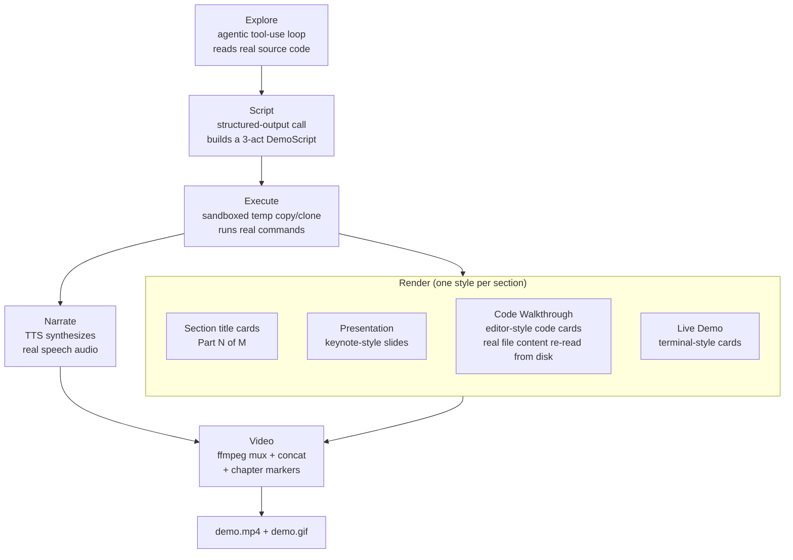

# agent-demoforge

Point agent-demoforge at a code repository. Get back a real, narrated video demo
of it — no script to write, no screen to record, no voiceover to read
aloud yourself.

agent-demoforge is an AI agent that actually **reads the code** of a target
repository (not just its README), decides what's genuinely worth
demonstrating, runs real commands against a disposable sandbox copy of the
repo, narrates the result with real synthesized speech, and renders it all
into a playable `demo.mp4` (plus a `demo.gif` you can drop straight into a
GitHub README) — structured as a three-act video: **Overview**, **Code
Walkthrough**, and **Live Demo**.

Below is the real `demo.gif` this repository's own pipeline produced for
the bundled `examples/toy_repo` project — generated end-to-end by the code
in this repo, with real audio, real command output, real source code read
from disk, and no hand-editing:


The GIF above is a silent, README-embeddable preview. The full version with
real narrated audio is checked into this repo at
[`docs/demo.mp4`](docs/demo.mp4) (58.34s, H.264 video + AAC audio, three
ffmpeg chapter markers — Overview / Code Walkthrough / Live Demo — narrated
in `Samantha`, macOS's calm female voice, and presented "on behalf of
Srinivasarao Polagani" via `--author-name`, generated by the exact command
in the Quickstart below) — GitHub doesn't autoplay video inline in a
README, so download or open that file directly to hear it.

## How it works

```mermaid
flowchart LR
    S1[["Part 1 of 3\nOverview"]] --> P1[Intro slide]
    P1 --> P2[What it does]
    P2 --> P3[Key features]
    P3 --> S2[["Part 2 of 3\nCode Walkthrough"]]
    S2 --> W1[Real file + line range #1]
    W1 --> W2[Real file + line range #2]
    W2 --> W3[Real file + line range #3]
    W3 --> S3[["Part 3 of 3\nLive Demo"]]
    S3 --> D1[Setup command]
    D1 --> D2[Demo commands...]
    D2 --> D3[Outro]
```





1. **Explore** — a manual agentic tool-use loop gives Claude two tools,
   `list_dir` and `read_file`, both confined to a copy of the target repo.
   The system prompt tells it to start with the README, then find the
   real entry point(s) and core source files, and to form its own
   source-grounded understanding of what the project does — rather than
   just paraphrasing the README's marketing copy back to you. This is the
   whole differentiator from a generic "summarize the README" tool.
   Best-effort transcript caching lives here — see **Explore-phase
   caching** below.
2. **Script** — once exploration is done, one structured-output call
   (`client.messages.parse(..., output_format=DemoScript)`) turns the
   conversation into an ordered, **three-act** list of `DemoBeat`s, each
   tagged with a `section` (`presentation`, `code_walkthrough`, or
   `live_demo`):
   - **presentation** beats carry `bullets` for a slide-style key-features
     list, grounded in what was actually found during Explore.
   - **code_walkthrough** beats carry a `code_ref` (`path`, `start_line`,
     `end_line`) pointing at a real file/line-range the model actually
     read via `read_file` during Explore — see **Code-walkthrough
     correctness** below for the guarantee this comes with.
   - **live_demo** beats are the original mechanic: narration, an
     optional real shell command, and a setup flag.

   Which sections get generated is controlled by `--sections` (see below).
3. **Execute** — every command in the script runs only inside a disposable
   temp copy (local path) or shallow clone (git URL) of the repo, in a
   fresh virtualenv if it looks like a Python project, with a per-command
   timeout, a hard cap on total commands, and a hard cap on total wall
   time. See **Safety** below.
4. **Narrate** — each beat's (and each section title card's) narration is
   synthesized to a real audio file via a pluggable TTS backend (macOS
   `say`, shipped and verified for real in this repo). If TTS isn't
   available, the pipeline degrades gracefully: it still produces the full
   script, visuals, and a silent-but-real video, and clearly reports what
   was skipped and why — it never just crashes.
5. **Render** — four distinct visual styles, one per beat kind:
   - **Section title cards** — a simple, bold, centered "Part N of M —
     &lt;Section&gt;" card, inserted at the start of every included section
     that has at least one beat.
   - **Presentation slides** — a clean, light, high-contrast "keynote"
     look: title text plus bullet points. Nothing terminal-like about it.
   - **Code walkthrough cards** — a dark, editor-like blue/charcoal card:
     filename + line-range header, monospace code, and a crude
     regex-based keyword/string/comment color heuristic for `.py` files
     (plain monospace for everything else). **The code text is always a
     fresh re-read of the real file from the sandboxed repo copy at
     render time — never the LLM's own output.** See below.
   - **Terminal cards** (unchanged) — the original dark, monospace render
     of a live_demo beat's narration, command, and (ANSI-stripped,
     truncated) captured output. Command beats render at least two frames
     — "about to run" and "ran, here's the output" — for visible
     progression.
6. **Video** — [`imageio-ffmpeg`](https://pypi.org/project/imageio-ffmpeg/)
   provides a real, working, pip-installable ffmpeg binary (no system
   ffmpeg install required). Per-beat frames are held for durations
   summing to at least the real narration audio duration (read directly
   from the AIFF file's `COMM` chunk — see **Implementation notes**), muxed
   with that audio, and all beat/section-title clips are concatenated into
   one `demo.mp4` with ffmpeg chapter markers at each section's start (see
   **Chapter markers** below). The same clips are re-rendered as a
   lightweight `demo.gif` for embedding directly in a README.

## Code-walkthrough correctness guarantee

This is the most important correctness property added in the three-act
structure, so it's called out on its own: **a code_walkthrough beat's
`code_ref` only ever tells the renderer *which* file and line range to
show — it is never the source of the on-screen text.** At render time,
`agent_demoforge/pipeline.py` calls `explorer.read_code_excerpt()`, which
re-opens the real file inside the sandboxed repo copy and re-reads exactly
those lines, straight off disk. The LLM's own narration text is never
substituted in as "code."

If the LLM hallucinates a path that doesn't exist, or a line range beyond
the file's real length (despite being explicitly instructed only to
reference files/lines it actually read during Explore), `read_code_excerpt`
clamps in-bounds ranges to the file's real length and returns `None` for a
genuinely missing/unreadable file — the pipeline then logs a warning and
renders a clean "code excerpt skipped" card instead of crashing or
fabricating code, while the beat's narration audio still plays normally.
This is directly unit-tested in `tests/test_code_walkthrough_integrity.py`,
including a beat whose narration contains text that must never end up
rendered as "code," proving the two are never conflated.

## Quickstart

```bash
git clone <this-repo-url> agent-demoforge
cd agent-demoforge
pip install -e .

agent-demoforge init        # writes .env.example -- copy it to .env and edit
export ANTHROPIC_API_KEY=sk-ant-...   # for the live Explore/Script phases

agent-demoforge generate examples/toy_repo --out demo_output --yes \
  --author-name "Your Name"   # optional: mentioned in the demo's intro
```

That produces, for real:

- `demo_output/demo.mp4` — a playable video with a real H.264 video track,
  a real AAC audio track of the narration, and ffmpeg chapter markers for
  each included section (best effort — see **Chapter markers**).
- `demo_output/demo.gif` — a lightweight silent preview, embeddable inline
  in a GitHub README.
- `demo_output/narration_script.md` — the full beat-by-beat transcript,
  including which section each beat belongs to, its bullets/code
  reference if any, and whether a code reference was actually resolved to
  real disk content.
- `demo_output/manifest.json` — a structured record of every beat and
  section title card: the command run, its exit code, captured output,
  audio duration, chapter marks, and whether any step was degraded or
  skipped.

No `ANTHROPIC_API_KEY`? agent-demoforge does not fail closed — it clearly
discloses that the Explore/Script phases are running as an offline
heuristic dry run (a small rule-based script built from what's on disk,
e.g. detecting a `pyproject.toml` console-script entry point, pulling a
real pitch sentence out of the README, and picking real
file+line-range excerpts for the code walkthrough), and still runs the
entire real Narrate/Render/Video pipeline against whatever script it
produced. `narration_script.md` and `manifest.json` both record which mode
ran.

## Configuration: CLI flags, `.env`, and environment variables

Every setting below can be set as a CLI flag, an environment variable
(including one loaded from a `.env` file in your current directory), or
left at its built-in default. **Precedence: CLI flag > environment
variable (`.env` included) > built-in default**, resolved consistently by
`agent_demoforge/config.py::resolve()`/`resolve_int()`/`resolve_model()` —
there's no ad-hoc precedence logic scattered per flag.

Run `agent-demoforge init` to write a `.env.example` into your current
directory (it will not overwrite an existing one) documenting every
variable below with its default; copy it to `.env` and uncomment/edit what
you want.

| Setting | CLI flag | Env var | Default | Purpose |
|---|---|---|---|---|
| Claude model | `--model` | `AGENT_DEMOFORGE_MODEL` (wins) / `ANTHROPIC_MODEL` (fallback) | `claude-opus-5` | Model for Explore/Script phases. `ANTHROPIC_MODEL` is kept as the pre-existing cross-project convention; `AGENT_DEMOFORGE_MODEL` is a higher-precedence, project-specific alias for consistency with everything else below. |
| Voice | `--voice` | `AGENT_DEMOFORGE_VOICE` | `Samantha` | macOS `say -v` voice name for narration audio. |
| Author credit | `--author-name` | `AGENT_DEMOFORGE_AUTHOR_NAME` | unset | If set, the intro beat naturally credits this person. **Renamed** from the old `DEMOFORGE_AUTHOR_NAME` for prefix consistency — see Changelog below. |
| Output directory | `--out` | `AGENT_DEMOFORGE_OUT` | `demo_output` | Where generated assets are written. |
| Source repo | positional `source` | `AGENT_DEMOFORGE_REPO` | none (required unless env set) | Lets `agent-demoforge generate` run with no positional argument. |
| Sections | `--sections` | `AGENT_DEMOFORGE_SECTIONS` | `presentation,code_walkthrough,live_demo` | Comma-separated subset of the three sections to include (see below). |
| Command cap | `--max-commands` | `AGENT_DEMOFORGE_MAX_COMMANDS` | `12` | Hard cap on total commands run. |
| Per-command timeout | `--per-command-timeout` | `AGENT_DEMOFORGE_PER_COMMAND_TIMEOUT` | `90` | Seconds. |
| Wall-time cap | `--max-wall-seconds` | `AGENT_DEMOFORGE_MAX_WALL_SECONDS` | `480` | Hard cap on total sandbox execution time. |
| API key | n/a | `ANTHROPIC_API_KEY` | none | Standard Anthropic SDK env var; without it, the offline dry-run fallback runs instead. |

Two flags are intentionally CLI-only (not part of the settings table above,
since they're one-shot behaviors rather than persistent configuration):
`--yes` (skip the confirmation prompt) and `--no-cache` (force a fresh
Explore phase, bypassing the cache described below).

### `--sections`

Controls which of the three acts get generated, e.g.:

```bash
agent-demoforge generate <repo> --sections live_demo              # original v0 behavior
agent-demoforge generate <repo> --sections presentation,live_demo # skip the code walkthrough
```

Both the live Script-writing instruction (`scriptwriter.build_script_instruction`)
and the offline fallback builder (`pipeline.build_fallback_script`) accept
the same `sections` list and only produce beats for the requested sections
— the pipeline additionally filters out (with a logged warning) any beat
whose section wasn't requested, in case a script disobeys the instruction.
Sections always render in the canonical order presentation → code_walkthrough
→ live_demo, restricted to whatever subset you asked for; a section-title
card is only inserted for a section that both was requested and ended up
with at least one beat.

### Pre-run cost/call estimate

Right after the safety confirmation (and before any command execution or
LLM call), agent-demoforge prints an honest, rough estimate of how many
`messages.create`/`messages.parse` calls the Explore+Script phases are
likely to make, e.g.:

```
agent-demoforge: this run will make an estimated 2-16 Claude API calls
(messages.create/messages.parse) for the Explore+Script phases. This is a
rough call-count range based on the exploration iteration cap, not a
token/cost prediction -- the exact number depends on how much exploration
the model decides it needs.
```

This is deliberately a call-count range, not a fabricated dollar figure —
the range narrows when `--sections` excludes `code_walkthrough`, since less
targeted exploration is typically needed.

## `agent-demoforge init`

```bash
agent-demoforge init
```

Writes `.env.example` (not `.env` itself, so it never silently overwrites
real secrets/config you already have) into the current directory, with
every setting above as a commented-out `# NAME=default` line plus a
one-line explanation. Refuses to overwrite an existing `.env.example`.
Copy it and edit:

```bash
cp .env.example .env
```

## Safety

- agent-demoforge **never touches your original repository**. A local path is
  `shutil.copytree`'d into a fresh `tempfile.mkdtemp()` directory before
  anything runs; a git URL is `git clone --depth 1`'d into one instead.
  Every command in the generated script executes with its working
  directory confined to that temp copy.
- Executing the generated script requires an explicit `--yes` flag, or an
  interactive `y/N` confirmation that prints exactly where commands are
  about to run (the temp path) and reiterates that your original path/URL
  will not be touched.
- Every command has a per-command timeout (default 90s), and the whole
  session is hard-capped on total command count (default 12) and total
  wall time (default 8 minutes / 480s) — all configurable via
  `--per-command-timeout`, `--max-commands`, and `--max-wall-seconds` (or
  their `AGENT_DEMOFORGE_*` env var equivalents).
- Path-confinement (`agent_demoforge/sandbox.py::safe_join`) is applied
  both to the Explore phase's `list_dir`/`read_file` tools and the
  render-time `read_code_excerpt` re-read, and is unit-tested against
  `..`-traversal and absolute-path-injection attempts.

## Command-line usage

```
agent-demoforge generate [<repo-path-or-git-url>] [--out demo_output] [--yes]
                    [--model claude-opus-5] [--max-commands 12]
                    [--per-command-timeout 90] [--max-wall-seconds 480]
                    [--voice Samantha] [--author-name "Your Name"]
                    [--sections presentation,code_walkthrough,live_demo]
                    [--no-cache]

agent-demoforge init
```

- `source` is optional if `AGENT_DEMOFORGE_REPO` is set.
- `--sections` (default: all three, in order) — see above.
- `--no-cache` — force a fresh Explore phase even if a cached transcript
  exists for this repo content + model (see **Explore-phase caching**).
- `--voice` (default `Samantha`, a calm, soft-spoken macOS female voice) —
  passed straight through to `say -v`. Run `say -v ?` to list every voice
  installed on your Mac and swap in whichever you prefer.
- `--author-name` (default: unset, also configurable via the
  `AGENT_DEMOFORGE_AUTHOR_NAME` env var — **renamed** from
  `DEMOFORGE_AUTHOR_NAME`, see Changelog) — when set, the demo's intro beat
  naturally mentions that person as the one who put the demo together,
  e.g. `--author-name "Srinivasarao Polagani"` produces an intro like
  *"Hi, I'm putting together a quick demo of \<project\> on behalf of
  Srinivasarao Polagani..."* — applied on both the live LLM script path
  and the offline fallback path.

## Explore-phase caching (best-effort — implemented, lightly verified)

**Status: implemented.** The Explore phase's tool-call/tool-result
transcript is cached under `.agent_demoforge_cache/` in your **current
working directory** (never inside the sandboxed temp repo copy, which gets
deleted after every run) — keyed by a fingerprint of the target repo's
content (`git rev-parse HEAD` if it's a git repo, else a hash of the full
relative-path+size file tree) plus the model name. On a cache hit,
agent-demoforge skips the live Explore tool-use loop entirely and reuses
the cached transcript, then runs the Script phase fresh every time (it's
one cheap call, and `--sections`/`--author-name`/`--voice` can change
independently of the repo's content). `--no-cache` forces a fresh Explore
regardless. Hits/misses are printed clearly, e.g.:

```
agent-demoforge: Explore-phase cache MISS -- running the live Explore tool-use loop.
agent-demoforge: Explore-phase cache HIT -- reusing the cached transcript and skipping the live tool-use loop.
```

**Verification honesty:** the fingerprinting logic and the save/load
round-trip (including converting Anthropic SDK response objects to plain
JSON-serializable dicts via `cache._to_plain`) are unit-tested offline
against synthetic transcripts in `tests/test_cache.py`. This module has
**not** been exercised end-to-end against a real live Explore transcript,
since no `ANTHROPIC_API_KEY` was available in the environment this was
built in. Treat it as implemented-and-plausible rather than
battle-tested until it's been run once against the live API.

## Chapter markers in demo.mp4 (best-effort — implemented and verified)

**Status: implemented and verified.** `agent_demoforge/video.py::concat_clips`
accepts an optional list of `(start_seconds, section_title)` marks; when
given, it writes an ffmpeg `FFMETADATA1` sidecar file
(`video.py::write_chapters_metadata`) and remuxes with
`-map_metadata 1 -map_chapters 1 -codec copy` (a stream copy, no
re-encode) to attach real chapter markers, falling back to the
un-chaptered file if that pass fails for any reason — this is a
nice-to-have and must never break the base video. Verified for real
against the bundled `imageio-ffmpeg` binary on the checked-in
`docs/demo.mp4`:

```
Duration: 00:01:02.01, start: 0.000000, bitrate: 155 kb/s
Chapters:
  Chapter #0:0: start 0.000000, end 19.561000
      title : Overview
  Chapter #0:1: start 19.561000, end 39.469000
      title : Code Walkthrough
  Chapter #0:2: start 39.469000, end 61.948000
      title : Live Demo
```

## Implementation notes

- Default model: `claude-opus-5`, overridable via `--model`,
  `AGENT_DEMOFORGE_MODEL`, or `ANTHROPIC_MODEL` (see precedence table
  above). Every call uses `thinking={"type": "adaptive"}`.
- The Explore phase is a hand-written agentic loop (not the SDK's beta
  tool runner), so the tool-execution and stopping logic is fully visible
  in `agent_demoforge/explorer.py`.
- `explorer.py::read_code_excerpt` is the render-time-only, always-real-disk
  code reader described above — a separate function from `read_file` (the
  LLM-facing tool), specifically so rendering can never accidentally trust
  LLM-authored text as code.
- AIFF audio duration is read by parsing the file's `COMM` chunk directly
  (channel count, sample-frame count, and an 80-bit IEEE-754 extended
  float sample rate) rather than via the standard library's `aifc`
  module — `aifc` was removed in Python 3.13 (PEP 594), so relying on it
  would break on current Python. This is implemented from scratch in
  `agent_demoforge/tts.py::read_aiff_duration` and is fully reliable for the
  files macOS `say` produces.
- All per-beat/section-title clips are encoded with one consistent
  H.264/AAC recipe so the final ffmpeg concat-demuxer pass reliably
  produces a single clean `demo.mp4`, whether or not chapter markers are
  attached afterward.
- `.env` loading (`cli.py`) explicitly passes
  `find_dotenv(usecwd=True)` to `load_dotenv()` rather than calling
  `load_dotenv()` bare — python-dotenv's own default search walks up from
  the *installed package's* file location, not the directory you're
  actually running `agent-demoforge` from, which would otherwise silently
  ignore a `.env` file sitting right next to where you invoked the
  command. This was caught by actually running the tool with a `.env`
  file during this feature's own verification, not assumed to work.

## Limitations

- **macOS-only TTS backend in v0.** Only `say` is implemented and
  verified. `agent_demoforge/tts.py::TTSBackend` is a small abstract interface —
  adding a Linux/Windows backend (Piper, a cloud TTS API, etc.) means
  implementing `is_available()` and `synthesize()` and wiring it into
  `get_default_backend()`; nothing else in the pipeline needs to change.
- **Simple, line-based terminal rendering.** Live-demo frames are plain
  monospace-on-dark-background renders of captured stdout/stderr with ANSI
  codes stripped — there's no ANSI color reproduction, cursor
  positioning, or TUI redraw support.
- **Crude code-highlighting heuristic.** The code walkthrough style's
  Python syntax coloring (`render.py::_highlight_python_tokens`) is a
  regex-based approximation, not a real tokenizer — good enough to make
  keywords/strings/comments visually distinct, not a faithful parser.
  Non-Python files render as plain monospace.
- **Short scripts by design.** Roughly 5–9 beats per included section —
  meant to produce a quick, watchable tour, not an exhaustive walkthrough.
- **No GUI/browser support.** Everything agent-demoforge demonstrates has to be
  drivable from the command line inside the sandbox; it can't drive a
  browser or a graphical application.
- **Command budget can leave a script partially demonstrated.** If a
  script names more commands than `--max-commands` allows, the remaining
  ones are skipped (and clearly marked as such in the output) rather than
  silently exceeding the cap.
- **Explore-phase caching is lightly verified** (see above) — the
  mechanism is implemented and unit-tested against synthetic data, but has
  not yet been exercised against a real live Explore transcript.

## Roadmap

- Exercise Explore-phase caching against a real `ANTHROPIC_API_KEY` run and
  confirm a genuine cache hit skips the live tool-use loop end-to-end.
- A real Python tokenizer (e.g. `tokenize`/`pygments`) for the code
  walkthrough style instead of the current regex heuristic, and
  highlighting support for more languages than Python.
- A non-macOS TTS backend.
- Optional reordering of `--sections` (currently always rendered in
  canonical presentation → code_walkthrough → live_demo order regardless
  of the order passed).

## Changelog / notes

- **Renamed** `DEMOFORGE_AUTHOR_NAME` → `AGENT_DEMOFORGE_AUTHOR_NAME` for
  consistency with every other setting's `AGENT_DEMOFORGE_` prefix. This
  project is pre-1.0, so it's a straight rename with no back-compat shim.
- Added the three-act structure (`presentation` / `code_walkthrough` /
  `live_demo` sections on `DemoBeat`), `--sections`, `.env` support via
  `python-dotenv`, `agent-demoforge init`, the pre-run cost estimate,
  best-effort Explore-phase caching, and best-effort mp4 chapter markers.

## Development

```bash
pip install -e ".[dev]"
pytest tests/
```

All tests are offline and fast. In addition to the original coverage
(ANSI-stripping/frame rendering, sandbox path confinement and command
timeout/cap enforcement, AIFF duration parsing), this now also covers:
CLI-flag/env-var/default precedence resolution and `--sections`
parsing/precedence (`test_config.py`), section-filtering on both the live
instruction builder and the offline fallback builder
(`test_sections.py`), the code-walkthrough always-real-disk-content
guarantee including a deliberately hallucinated/out-of-bounds reference
(`test_code_walkthrough_integrity.py`), the three new render styles being
real, correctly-sized, and visually distinct PNGs (`test_render_new_styles.py`),
the Explore-phase cache's fingerprinting and save/load round-trip
(`test_cache.py`), and `agent-demoforge init` writing a well-formed
`.env.example` (`test_cli_init.py`).

## License

MIT — see [LICENSE](LICENSE).
